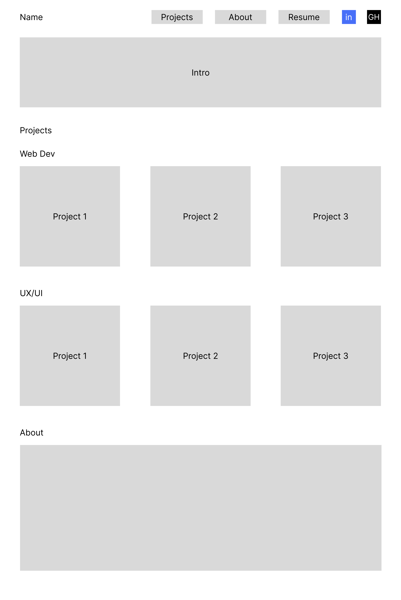
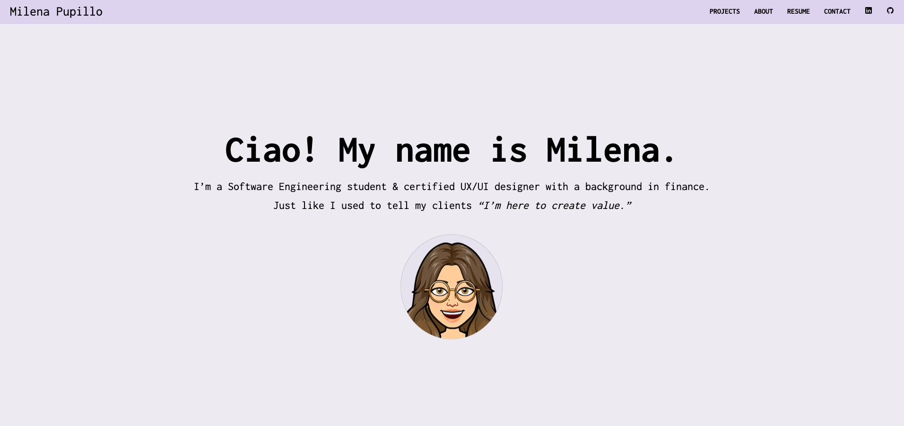
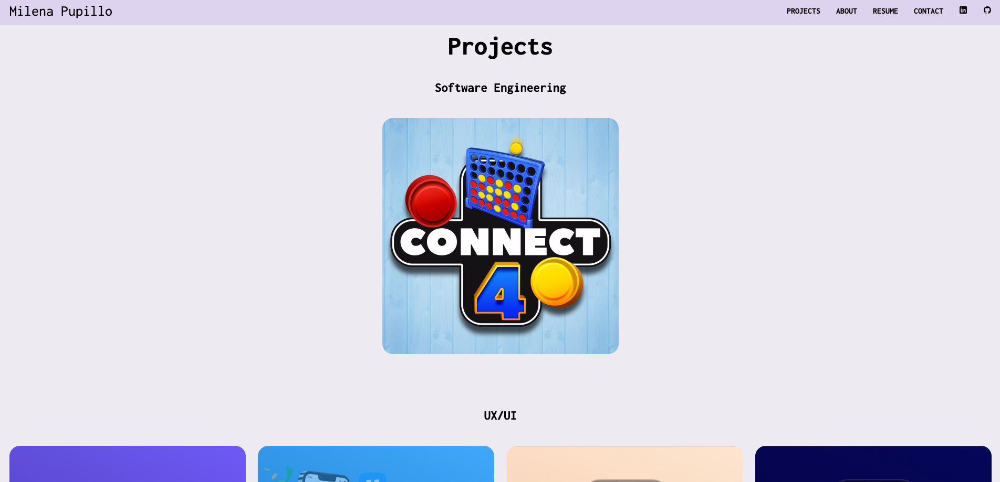
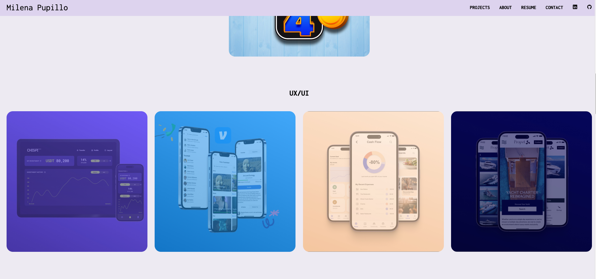
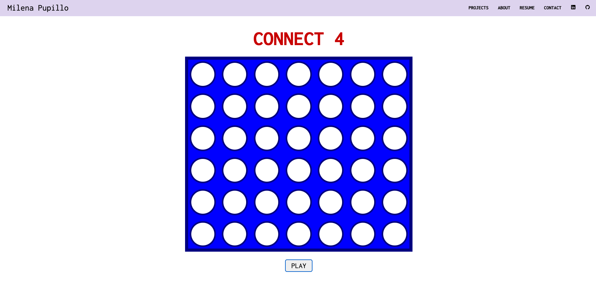
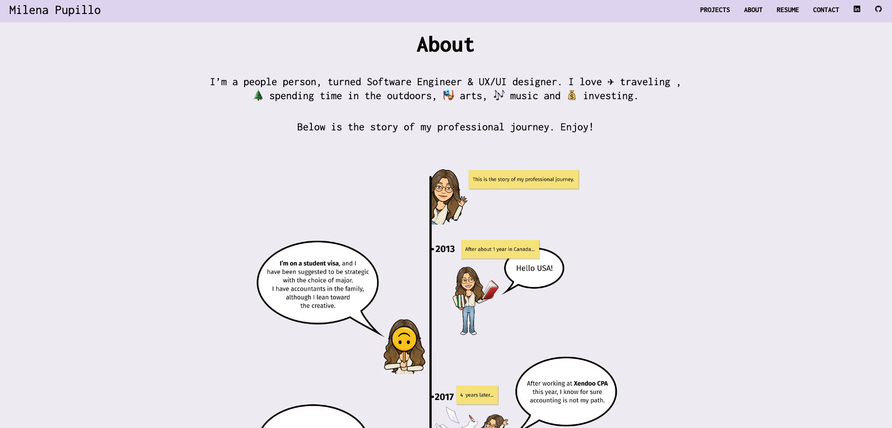
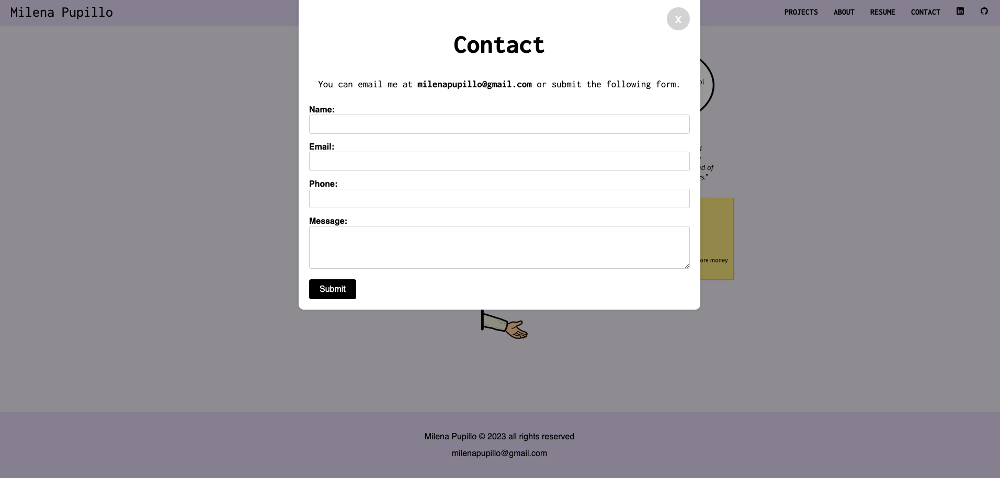

# Project 1: Portfolio & Mini-Game

## :art: Screenshots

Wireframe

Home

Projects

Mini-game

About

Contact

## :robot: Technologies Used

   

## :link: Links

Deployed Link

<a href="https://milenap11.github.io/portfolio/">Portfolio</a>

## :rocket: Walkthrough

Welcome to my brand new portfolio! Here you can find my projects, including my previous work as UX/UI designer, my contact and a little bit of information about me. 

## :pencil: User Stories

- As someone just met at a networking event, I want to quickly see the developer's skills, so that I can recommend the person to my company or someone who I know. 
- As a non-technical HR manager, I want to quickly see the skills and experience of a candidate, so that I can evaluate whether the candidate meets the requirements for an open position at my company.
- As a mid-level engineer, I want to view a junior developer's project and read their code, so that I can evaluate their coding skills.

## :triangular_flag_on_post: Unsolved Problems & Hurdles

## :dart: Next Steps

- [ ] Make site mobile friendly
- [ ] Add UI elements